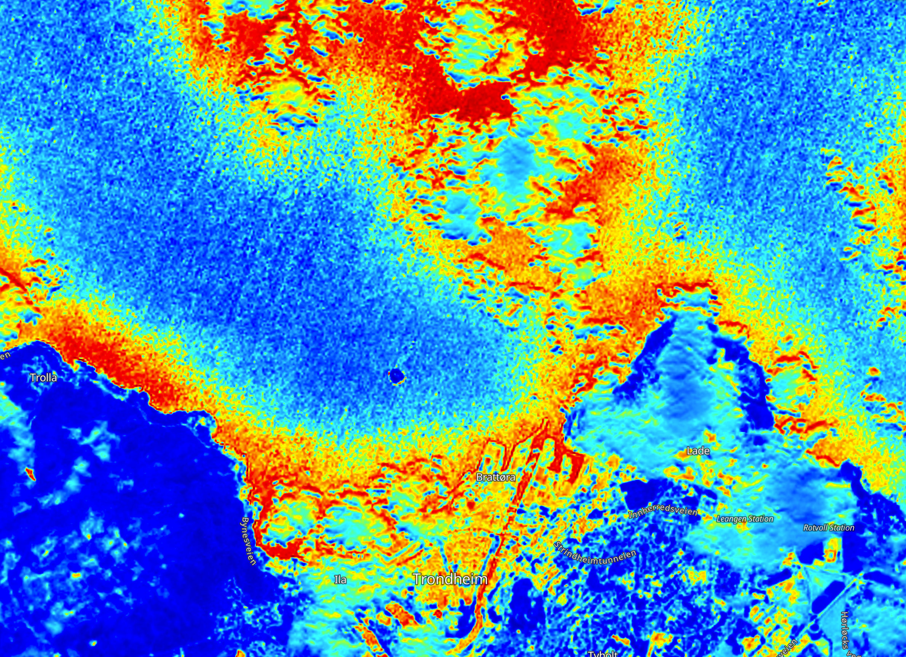
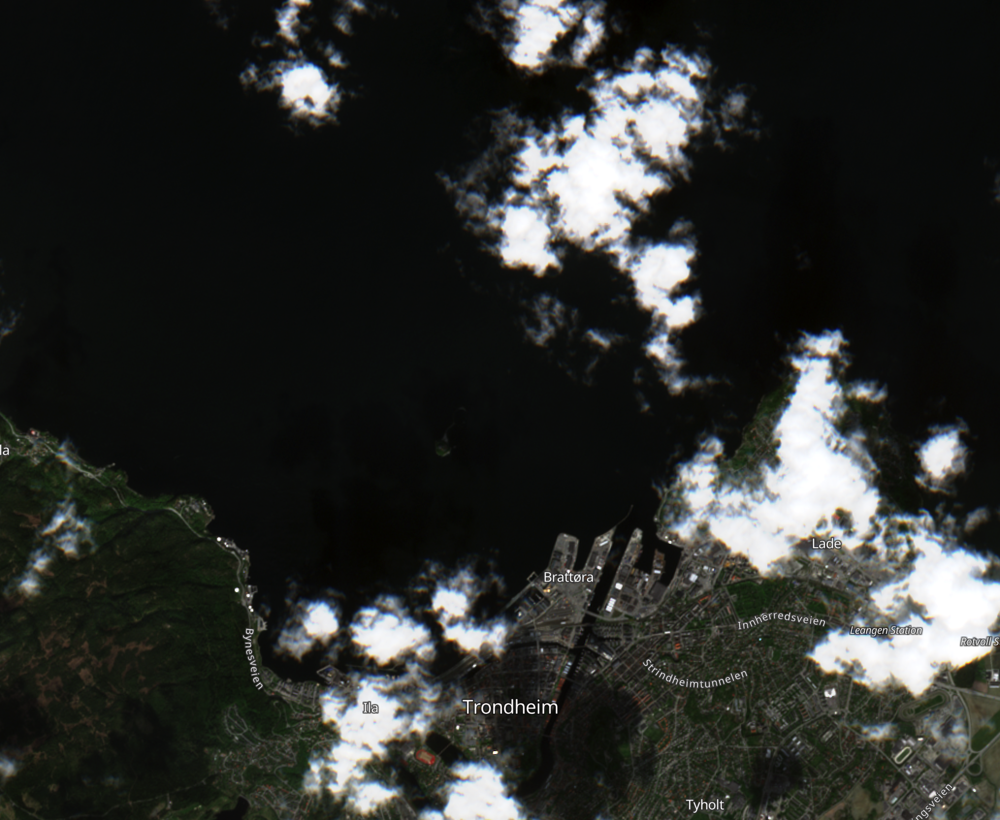
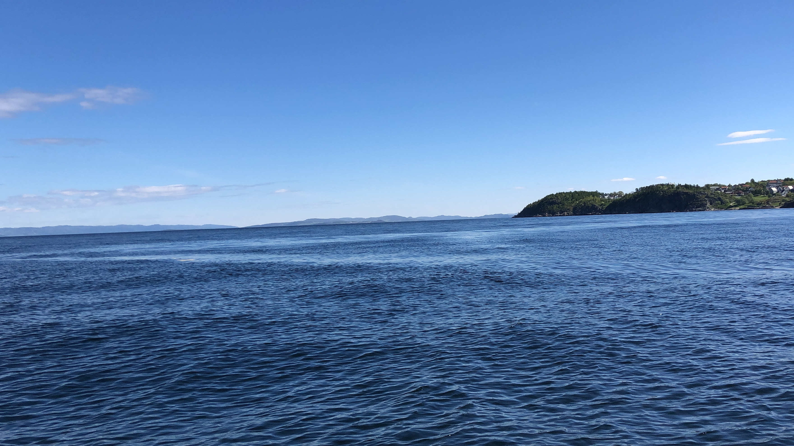
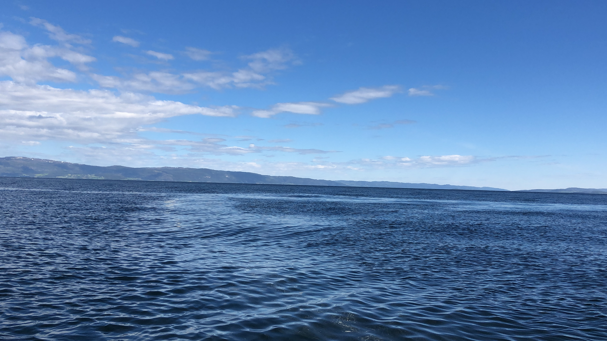

# 3D visualisation for the mission

The prior is shown in the following figure. 
[Prior](Report/sal_mu_prior.html)

The updated salinity field is shown in the following figure. 
[Updated salinity](Report/sal_mu_cond.html)

The updated excursion probability field is shown in the following figure. 
[Updated Excursion Probability](Report/sal_EP.html)

# Pipeline

- [X] Prior modelling
  - Generate the prior mean from SINMOD data with adding the intercept
  - Generate the trend from the SINMOD data
- [ ] Path planning
  - Generate the initial starting point
  - Generate the next waypoint based on EIBV
  - Move the AUV and collect the data
  - Update the field

# Missions conducted under MASCOT project

---

## Mission I: Nidelva's river plume exploration

###### [Duration: 26th-May - present]
###### [Objective: Get used to autonomous ocean sampling framework]
###### [Outcome: The AUV is able to sample the ocean autonomously]

### Mission log:

<!-- 
 -->
  <!-- 
26th-May-2021
 -->

###### Log:
- LAUV cannot be logged in, which will be solved by Tore today. 
- Boat is not ready, which will be solved tomorrow morning. 
- Naked eyes can barely see the plume.
- Satellite images from yesterday (25th-May) were exploited, not so much can tell (attached below).
- We discussed some future improvements and possibilities about the missions

###### Plan:
- May-26th, we will do lawn mower manoeuvres as many as we can, as dense as we are allowed to get a better understanding of the plume. 
- 3D simple model will be tested first, and decide whether to continue with complex ones based on what we get. 

###### Results:

<!-- (https://apps.sentinel-hub.com/eo-browser/?zoom=13&lat=63.45481&lng=10.39547&themeId=DEFAULT-THEME&visualizationUrl=https%3A%2F%2Fservices.sentinel-hub.com%2Fogc%2Fwms%2Fbd86bcc0-f318-402b-a145-015f85b9427e&datasetId=S2L2A&fromTime=2021-05-25T00%3A00%3A00.000Z&toTime=2021-05-25T23%3A59%3A59.999Z&layerId=1_TRUE_COLOR) -->

<!-- (https://apps.sentinel-hub.com/eo-browser/?zoom=13&lat=63.45481&lng=10.39547&themeId=DEFAULT-THEME&visualizationUrl=https%3A%2F%2Fservices.sentinel-hub.com%2Fogc%2Fwms%2Fbd86bcc0-f318-402b-a145-015f85b9427e&datasetId=S2L2A&fromTime=2021-05-25T00%3A00%3A00.000Z&toTime=2021-05-25T23%3A59%3A59.999Z&layerId=5-MOISTURE-INDEX1) -->

<!-- 
 -->

<!-- 
 -->
  <!-- 
27th-May-2021
 -->
 
###### Duration: 9:00 - 14:30
###### Number of tests: multiple lawn mowers
###### Log:
- In the morning, some small problems occurred, cable issues, but easily fixed.
- When driving the boat from TBS to the outlet of the Nidelva, naked eyes can easily distinguish the water plume, see figures below.
- Satellite images cannot be loaded, since it takes every three days to travel to the same place for the satellite, which is sad since it can easily tell from the satellite image if we could have one.
- Tide was low in the morning, but rised a bit afterwards.
- 2 transect line survey lines have been inspected.
- 3 lawn mowers have been deployed, depth 0.5, 2, 5 were surveyed respectively.
- In the end, 1 elevator and 1 yoyo manoeuvre pattern were conducted.
- After the field work, we had some discussions on the results we obtained from the trip. Tore is happy now since everything worked perfectly and data looks promising. 

###### Plan:
- Friday (28th-May) and next Monday (31th-May), we will mainly work on the data analysis and model development based on the data. 
- Tuesday (1st-June) and on is set to be the integration workshop and more field with adaptive framework. 

###### Results:

<!--  -->

<!-- 
 -->

---

# Contact

Please contact Yaolin Ge (yaolin.ge@ntnu.no) if you have any questions. 😁 🤔 🤘

# References

[Semi-variance and covariance](https://www.aspexit.com/en/fundamental-assumptions-of-the-variogram-second-order-stationarity-intrinsic-stationarity-what-is-this-all-about/#Intrinsic_stationarity)

[variogram](https://scikit-gstat.readthedocs.io/en/latest/userguide/variogram.html)

[variogram notes](https://gsp.humboldt.edu/olm/R/04_01_Variograms.html)

[variogram slides](https://slideplayer.com/slide/8781466/)

[Python statistics](https://towardsdatascience.com/python-statistics-for-beginners-pearson-correlation-coefficient-69c9b1ef17f7)

# To use the server remotely with GUI installed
# GUI:
- XQuartz launched
- Use Xterm with:
  `ssh -Y syvert.math.ntnu.no`
Then the GUI mode should be activated

